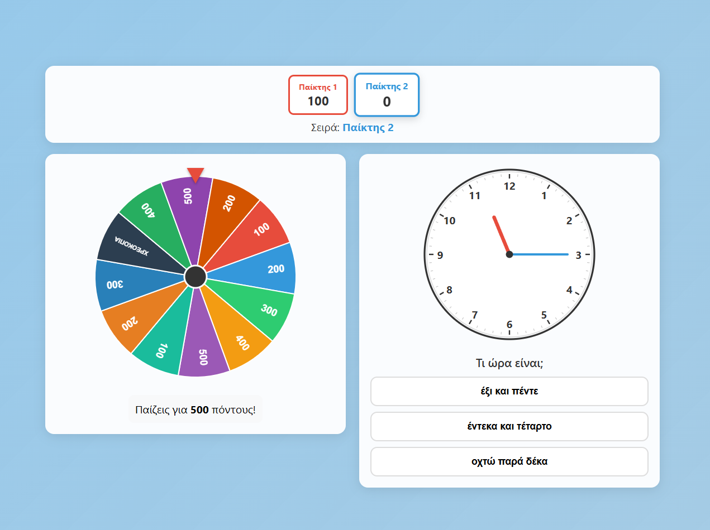

# 🎡 Τροχός της Τύχης - Τι Ώρα Είναι;

Ένα εκπαιδευτικό παιχνίδι τύπου "Τροχός της Τύχης" για την εκμάθηση της ώρας στα Ελληνικά.

🎮 **[Παίξε τώρα!](https://dpantaz.github.io/time-tell-wheel-of-fortune/)**



## Πώς παίζεται

1. **Ρύθμιση** — Επιλέξτε αριθμό παικτών (2-4) και χρώμα για τον καθένα
2. **Γύρισε τον τροχό** — Ο τροχός καθορίζει τους πόντους του γύρου ή ΧΡΕΟΚΟΠΙΑ (χάνεις τα πάντα)
3. **Απάντησε** — Δες την ώρα στο αναλογικό ρολόι και διάλεξε τη σωστή απάντηση από τις 3 επιλογές
4. **Κέρδισε** — Σωστή απάντηση = κερδίζεις τους πόντους, λάθος = χάνεις τον γύρο

Κάθε παίκτης παίζει 5 γύρους. Νικάει αυτός με τους περισσότερους πόντους!

## Εκτέλεση

### Με Docker

```bash
docker compose up --build
```

Η εφαρμογή είναι διαθέσιμη στο http://localhost:8080

### Χωρίς Docker

Ανοίξτε απλά το `src/index.html` σε έναν browser.

## Container Image

Το image δημοσιεύεται αυτόματα στο GitHub Container Registry σε κάθε push στο `main`:

```bash
docker pull ghcr.io/dpantaz/time-tell-wheel-of-fortune:latest
docker run -p 8080:80 ghcr.io/dpantaz/time-tell-wheel-of-fortune:latest
```

## Τεχνολογίες

- Vanilla HTML/CSS/JavaScript
- Canvas API (τροχός)
- SVG (αναλογικό ρολόι)
- Nginx Alpine (serving)
- GitHub Actions (CI/CD)
